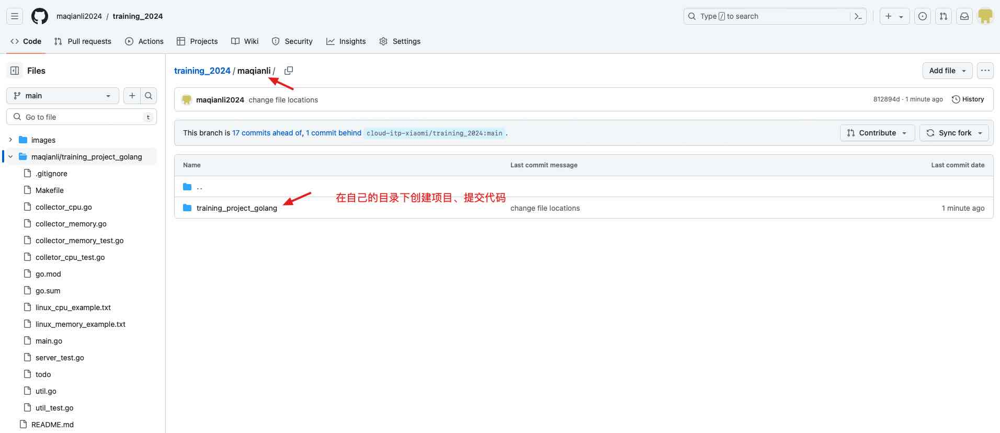

# training_2024
本仓库包含 2024 年小米工程师训练营技术委-ITP-云平台部门的培训项目。

**提交方式：**
1. 每个学员将本仓库 fork 到自己的空间

2. 将自己空间下 fork 的代码仓库 clone 到本地
3. 每个学员在仓库的根目录下创建一个目录，名称为自己的名字的拼音，如 maqianli
4. 在自己的目录下创建项目，提交代码（不要改其他人目录下的内容）

5. 提交 Pull Request 到 [cloud-itp-xiaomi/training_2024](https://github.com/cloud-itp-xiaomi/training_2024)

6. 由管理员最后处理 Pull Request，将代码合并到主分支
