## 实现过程：（代码在code文件内）

#### 思路：

* 在客户端主机进行本地域名解析，能够通过www.crz.com访问LVS服务
* 后端nginx服务器主机上，对nginx配置文件进行修改，使其能够监听从lvs服务器转发过来的信息，并根据不同的请求路径返回对应的文件内容。
* 在nginx服务器主机上，设置免密连接LVS主机。
* 通过在lvs服务器上使用ipvsadm工具，搭建集群，使得客户端流量到达LVS服务时，LVS能够将客户端的请求均衡转发到后端服务器上。我搭建的LVS负载均衡为NAT模式，使用轮询调度算法。
* 通过在nginx服务器上运行编写好的shell脚本，对后端nginx服务器的日志文件进行分析，分析结果包含nginx服务器每分钟接收到的请求数，以每分钟http code（状态码）为200和500+的数量，将分析结果存入到LVS服务器地址的root用户的MySQL库中，在LVS主机上查看分析结果。


* 场景1.用户通过www.crz.com的方式访问lvs服务，lvs将请求均衡转发到nginx服务，然后根据不同请求路径/静态文件，nginx返回不同html文件内容

##### 本地域名解析

在文件中添加内容：172.30.154.100  www.crz.com

```bash
vim /etc/hosts
```


##### nginx配置文件修改

```bash 
vim /etc/nginx/nginx.conf
```

在http块下将server块改成

```bash
server {
	listen   80;
	server_name    localhost;

location = /mi.html{
	root  /usr/share/nginx/html;
}
location = /hello.html{
	root /usr/share/nginx/html;
}
location /{
	root   /usr/share/nginx/html;
	index   index.html;
}
}
```

server块中对应的html需要自己到对应的目录去创建。否则会找不到文件。


检查配置文件信息并启动nginx服务

```bash
cd /usr/sbin/
./nginx -t
./nginx
```

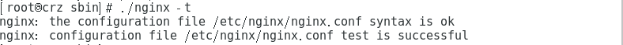


##### LVS上通过curl命令测试是否成功配置并启动

```bash
curl 192.168.222.135
curl 192.168.222.136
```

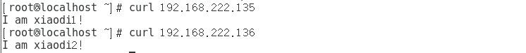

如果客户端访问www.crz.com 则将会返回html文件   I am xiaodi1！ 或者 I am xiaodi2！

若访问www.crz.com/mi.html 则将会返回mi.html文件  I love xiaomi！ I am xiaodi1！ 或者 I love xiaomi！ I am xiaodi2！

若访问www.crz.com/hello.html 则将会返回hello.html文件   Hello World！ I am xiaodi1！ 或者 Hello World！ I am xiaodi2！


##### 在nginx虚拟主机上，设置免密连接LVS主机

```bash
ssh-keygen #生成ssh密匙
ssh-copy-id root@192.168.222.132 #免密连接lvs主机
ssh root@192.168.222.132 #验证是否成功登入
```


##### LVS负载均衡搭建

```bash
modprobe ip_vs #加载ip_vs模块
sysctl -w net.ipv4.ip_forward=1 #启动临时转发
ipvsadm -C #清除原有规则
ipvsadm -A -t 172.30.154.100:80 -s rr #rr表示轮询
ipvsadm -a -t 172.30.154.100:80 -r 192.168.222.135 -m
ipvsadm -a -t 172.30.154.100:80 -r 192.168.222.136 -m #-m表示NAT模式
ipvsadm -Ln #查看集群
```

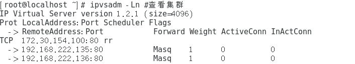


##### 在客户端浏览器对LVS集群进行访问，查看场景一功能是否成功实现。

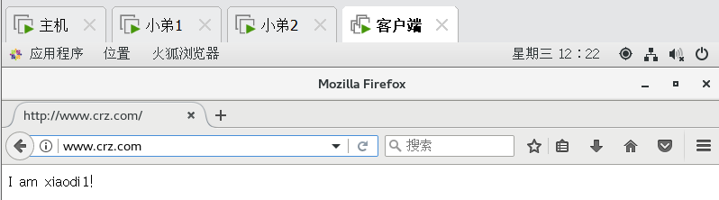

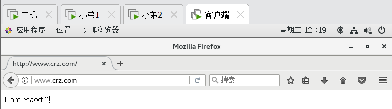

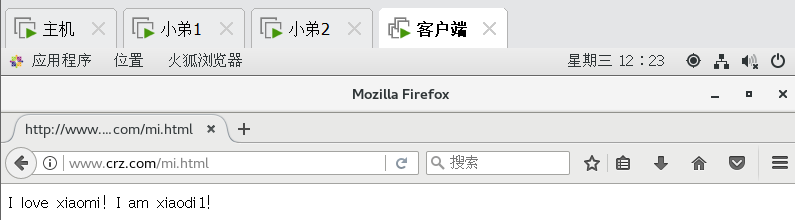

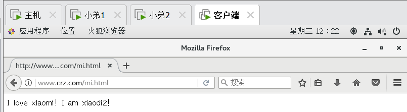

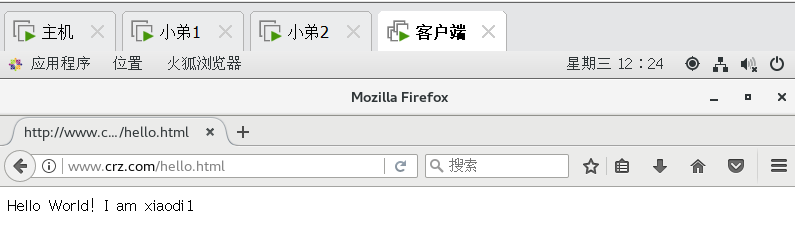

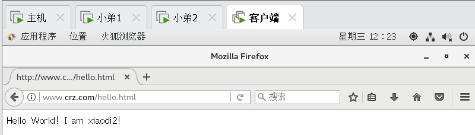


##### 可以看到，场景一已经实现


* 场景2.通过shell或者python脚本，去分析2台nginx机器上的access 日志，把qps（每秒的请求数）和http code为200 和500+的数量按照1分钟统计出来， 都保存到mysql数据库中。

###### 运行脚本查看结果

在nginx主机上运行脚本，查看所分析的结果。

```bash
cd ~
./shell.sh
```

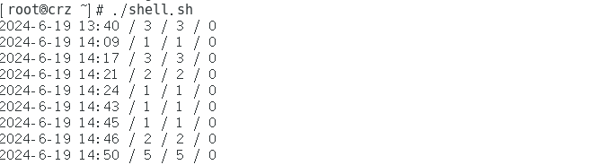

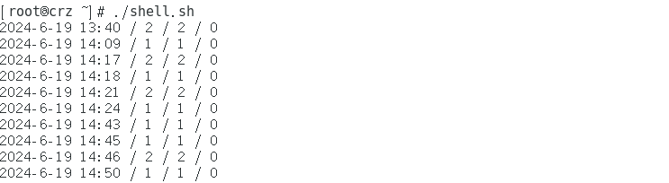


在lvs主机登录MySQL

```bash
mysql -uroot -p
```

查看对应的表是否导入数据：

```bash
use logs;
select * from log;
select * from log1;
```

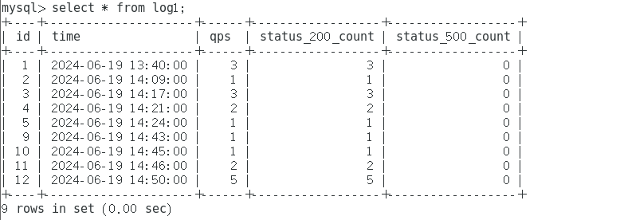

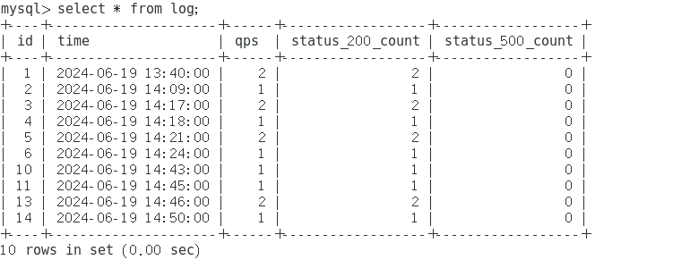


在nginx服务器上设置脚本自动运行：

```bash
#编辑crontab文件
crontab -e
#在文件内加入以下内容
*/5 * * * * /root/shell.sh
#检查是否成功设置
crontab -l
```

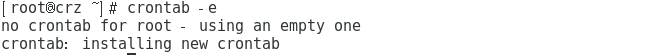


脚本定时运行设置成功。


至此，场景二功能已经基本实现。

