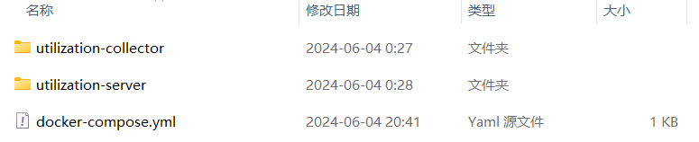
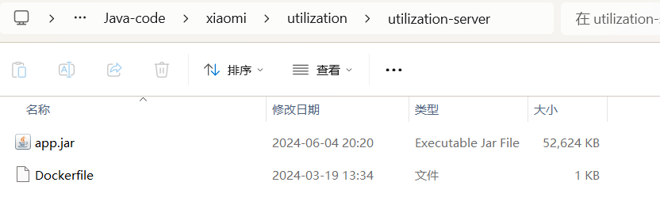
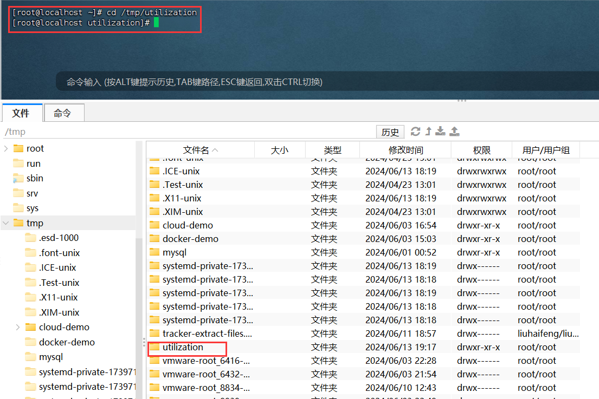
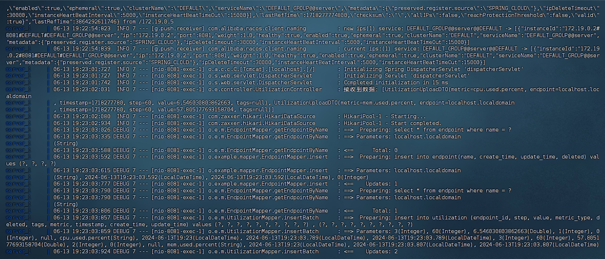
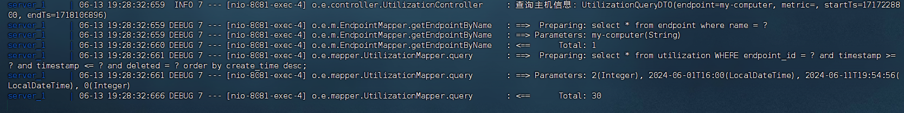

# README

## 一、项目描述

该项目是一个采集Linux系统的cpu和内存利用率的项目，通过DockerCompose部署在Linux上运行，utilization-collector负责采集Linux系统的cpu和内存的利用率，并将结果通过feign上传到utilization-server服务，最后utilization-server将数据存储到MySQL

## 二、运行该项所需环境

Linux系统、Linux系统上安装Docker、Linux系统上安装DockerCompose

## 三、将项目部署至Linux

注意：由于用到DockersCompose进行的部署，collector模块和server模块中的application.yml文件和bootstrap.yml文件中的相关配置需要更改成服务名称

- nacos的server-addr属性改成`nacos:8848`
- mysql的url改成`jdbc:mysql://mysql:3306/linux_utilization?useSSL=false&allowPublicKeyRetrieval=true`
- redis的host属性改成`redis`

1、用idea打开项目，使用maven的插件将项目通过package打包，打包后会在对应模块下的target目录下生成app.jar文件

2、新建一个文件加utilization用于存放jar包和Dockerfile、docker-compose文件，utilization文件夹的结构如图






3、将utilization-collector模块的app.jar放入utilization-collector文件夹、将utilization-server模块的app.jar放入utilization-server文件夹

4、在两个文件夹中添加Dockerfile文件，文件内容为

```
FROM java:8-alpine # 基于java:8-alpine构建镜像
COPY ./app.jar /tmp/app.jar
ENTRYPOINT java -jar /tmp/app.jar
```

5、在cpu目录下添加docker-compose.yml文件

```yaml
version: "3.2"  # dockercompose的版本

services:
  nacos:
    image: nacos/nacos-server #指定镜像
    environment:
      MODE: standalone # 单机部署模式
      TZ: "Asia/Shanghai" # 设置时区
    ports:
      - "8848:8848" # 开放端口映，左边为宿主机端口，右边为容器内端口
  mysql:
    image: mysql:5.7.25
    environment:
      MYSQL_ROOT_PASSWORD: 123 # 设置mysql root用户的密码
      TZ: "Asia/Shanghai"
    volumes:
      - "宿主机中用于存放mysql数据的目录:/var/lib/mysql" # 例如 /tmp/mysql/data
      - "宿主机中用于存放mysql配置的目录:/etc/mysql/conf.d/" # 例如 /tmp/mysql/conf
    ports: 
      - "3306:3306"
  redis: 
    image: redis:latest
    ports: 
      - "6379:6379"
    environment:
      TZ: "Asia/Shanghai"
  collector:
    build: ./utilization-collector # 基于utilization-collector文件夹的app.jar和Dockerfile构建镜像
    environment:
      TZ: "Asia/Shanghai"
    volumes:
      - "/proc/stat:/hostinfo/proc/stat" # 为了采集到宿主机的信息把宿主机上的文件夹挂载到容器内
      - "/proc/meminfo:/hostinfo/proc/meminfo"
      - "/etc/hostname:/hostinfo/proc/hostname"
  server:
    build: ./utilization-server
    ports: 
      - "8081:8081" # 开发该服务的端口，部署后可通过宿主机ip地址加端口号访问到项目中的接口
    environment:
      TZ: "Asia/Shanghai"

```

6、将utilization文件上传到虚拟机，并cd到该目录下



7、执行`docker-compose up -d`命令部署服务


8、执行`docker-compose logs -f nacos`命令查看nacos运行日志


9、当nacos启动后，可通过linux服务器ip:8848访问到nacos，发现服务并未启动成功，原因是nacos启动比collector和server慢导致服务注册不上nacos


10、重启服务`docker-compose restart server collector`


11、通过`docker-compose logs -f`查看日志，发现项目启动成功



12、通过Apifox请求接口





