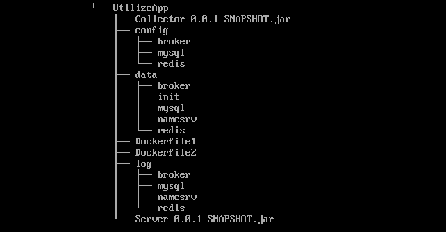

# 作业一
## 项目详情
作业一整合了MySQL、Redis与RocketMQ, Collector模块负责采集主机利用率信息，是RocketMQ的生产者<br/>
Server模块负责消费信息并存储至MySQL和Redis中<br/>
该项目所有模块以及使用的组件均部署在Docker中<br/>
Linux系统中需要安装JDK17和Docker<br/>
防火墙需要关闭或者放行相应端口<br/>
打包好的Collector和Server模块和Dockerfile文件要放在同一目录下
## 目录说明
config中为Redis、MySQL、RocketMQ相应的配置文件
## 运行
1. 在Linux系统下创建如下目录<br/>
   
2. 在config下创建如下目录，配置文件在主目录config文件夹下<br/>
   
3. 创建并运行MySQL容器
   ```
   docker pull mysql:latest 
   docker run -d -p 3306:3306 -v /usr/local/mysql/conf:/etc/mysql/conf.d -v /usr/local/mysql/data:/var/lib/mysql -e MYSQL_ROOT_PASSWORD=123456 --name  mysql mysql:latest
4. 创建并运行Redis容器
   ```
   docker pull redis:latest 
   docker run -p 6379:6379 --name redis --privileged=true -v /home/UtilizeApp/config/redis/redis.conf:/etc/redis/redis.conf -v /home/UtilizeApp/data/redis:/data/redis -d redis redis-server /etc/redis/redis.conf
5. 创建并运行RocketMQ相关容器
   ```
   docker pull rocketmqinc/rocketmq
   docker run -d -p 10911:10911 -p 10909:10909 -v  /home/UtilizeApp/log/broker:/root/logs -v   /home/UtilizeApp/data/broker:/root/store -v  /home/UtilizeApp/config/broker/broker.conf:/opt/rocketmq/conf/broker.conf --name rmqbroker --link 
   rmqnamesrv:namesrv -e 
   "NAMESRV_ADDR=namesrv:19876" -e "MAX_POSSIBLE_HEAP=200000000" rocketmqinc/rocketmq sh mqbroker -c /opt/rocketmq/conf/broker.conf
   docker run -d -p 9876:9876 -v /home/UtilizeApp/log/namesrv:/root/logs -v /home/UtilizeApp/data/namesrv:/root/store --name rmqnamesrv -e "MAX_POSSIBLE_HEAP=100000000" rocketmqinc/rocketmq sh mqnamesrv
   docker run -d --name rmqconsole -p 8180:8180 --link rmqnamesrv:namesrv -e "JAVA_OPTS=-Drocketmq.namesrv.addr=namesrv:9876 -Dcom.rocketmq.sendMessageWithVIPChannel=false"  -t styletang/rocketmq-console-ng
6. 构建collector镜像并运行相应容器
    ```
    docker build -f ./Dockerfile1 -t collector .
    docker run -d -p 8080:8080 --name collector collector:latest
7. 构建server镜像并运行相应容器
    ```
    docker build -f ./Dockerfile2 -t server .
    docker run -d -p 8083:8083 --name server ser
8. 在浏览器中输入 http://hostName:port/api/metric/query?endpint=param1&start_ts=param2&end_ts=param3 即可访问query接口,queryByMetric同理
