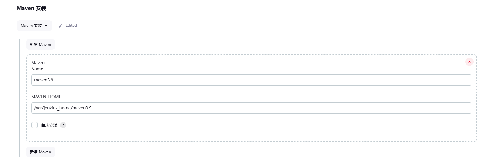
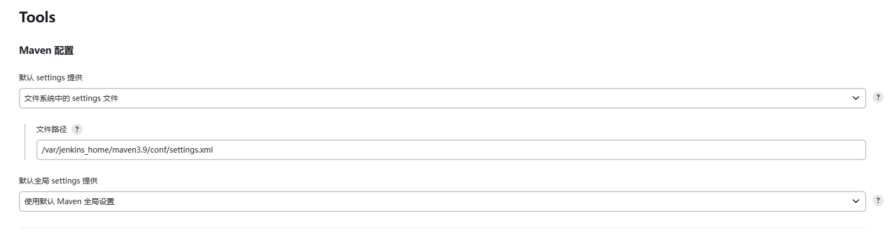
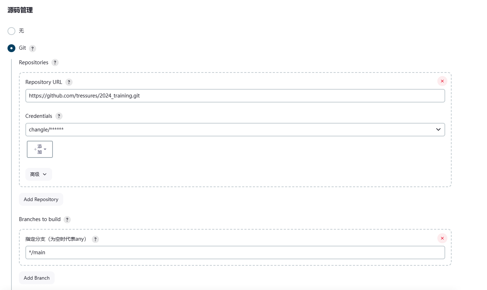
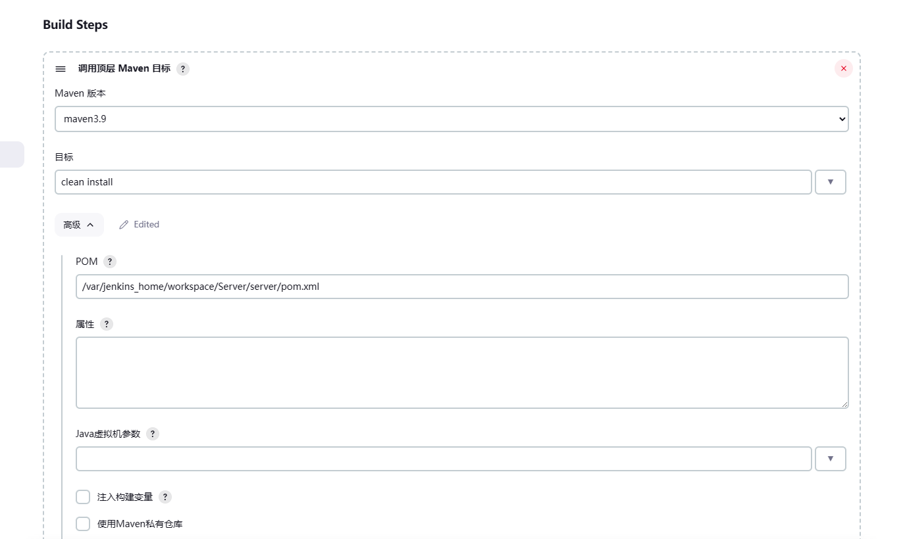
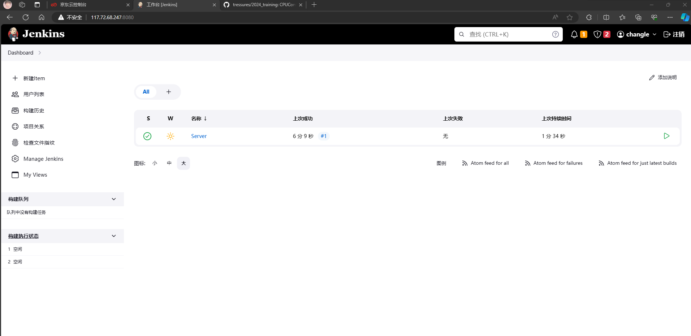
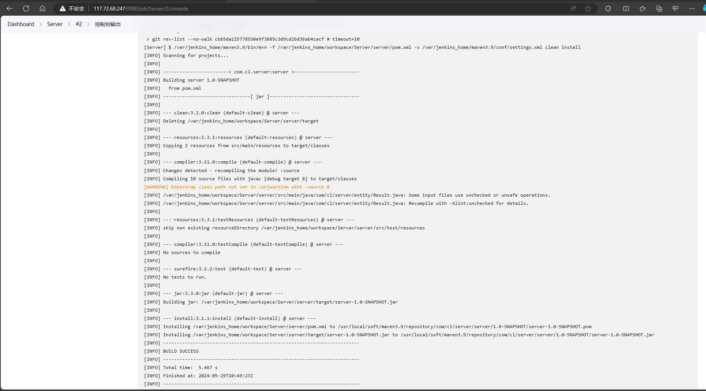
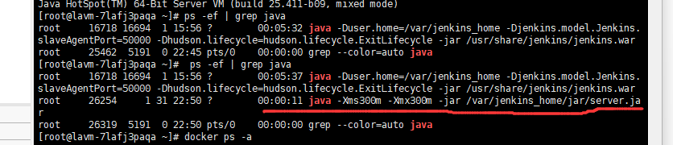

# 1. 项目描述

本项目在CentOS 7.6系统下,基于Java开发，部署在服务器上运行，用于采集计算机cpu和内存的利用率以及监听指定路径下的日志文件变化。

# 2. 技术栈

Spring Boot + Spring Cloud Alibaba + Mybatis-Plus + Redis + Mysql + ElasticSearch

# 3. 项目部署、运行

## 3.1 依赖环境

 Jdk：1.8

Maven：3.9.3

Git：2.42.3（个人视情况选择）

Docker：容器管理

--MySQL：数据库

--Redis：缓存

--Jenkins：项目自动部署工具

--xxl-job：定时任务管理

--Nacos：动态配置

--Elasticsearch：数据存储与检索

## 3.2 项目部署及运行（Jenkins+shell脚本）

上述docker相关镜像容器默认已经安装好了并配好对应端口（服务器防火墙记得开放）

- Docker安装Jenkins

```Shell
docker search jenkins
docker pull jenkins/jenkins:2.414.2
docker run -d -u root -p 8080:8080 -p 50000:50000 -v /var/jenkins_home:/var/jenkins_home -v /etc/localtime:/etc/localtime --name jenkins jenkins/jenkins:2.414.2
docker logs afdc75a54567     //查看Jenkins启动日志获取管理员密码
```

- Jenkins全局Maven

注意：maven一定要放到Jenkins的数据挂载目录内，这样容器才能读到。

```
cp -r  你的服务器Maven路径  /var/jenkins_home/
```



- 新建模块任务（以server模块为例）
  
1.配置git地址
  

2.调用Maven顶层目标
  

3.使用ssh插件发送shell脚本至服务器

```Shell
cp /var/jenkins_home/workspace/Server/server/target/server.jar /var/jenkins_home/jar/
#!/bin/bash
APP_NAME=server.jar
LOG_NAME=/var/log/server.log

pid=ps -ef | grep $APP_NAME | grep -v grep|awk '{print $2}'

function is_exist(){
pid=ps -ef | grep $APP_NAME | grep -v grep|awk '{print $2}'
if [ -z ${pid} ]; then
String="notExist"
echo $String
else
String="exist"
echo $String
fi
}

str=$(is_exist)
if [ ${str} = "exist" ]; then
echo " 检测到已经启动的程序，pid 是 ${pid} "
kill -9 $pid
else
echo " 程序没有启动了 "
echo "${APP_NAME} is not running"
fi

str=$(is_exist)
if [ ${str} = "exist" ]; then
echo "${APP_NAME} 已经启动了. pid=${pid} ."
else
source /etc/profile
BUILD_ID=dontKillMe
nohup java -Xms300m -Xmx300m -jar /var/jenkins_home/jar/$APP_NAME   >$LOG_NAME 2>&1 &
echo "程序已重新启动..."
fi
```

- 运行server模块任务

控制台出现以下效果即可


- 服务器Java进程


