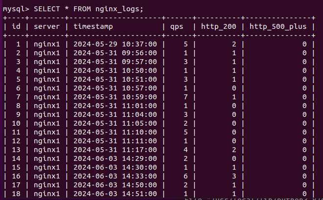

# 2024_training

作业要求：https://github.com/Chocolate2323/training_2024/blob/main/xuteng/README.md

# 简介：

搭建了一套负载均衡服务，用户可以访问服务器上的静态文件，lvs会根据负载均衡将请求转发到相应的服务器上，服务器上的日志会被解析并提取出关键信息，最后存入数据库。

# 功能介绍：

setup_lvs.sh

主要实现对lvs的配置，将虚拟机（192.168.137.129）作为流量转发的入口，配置DNS使得可以将www.xuteng.com映射到该虚拟机的ip地址。在这个lvs集群中，主要有三台nginx服务器，其中两台是由docker容器（占用虚拟机的两个端口）实现，另外一台是新的虚拟机（192.168.137.131），在配置中制定了lvs的调度算法为轮询调度（RR）。

nginx.conf

nginx服务器上的配置文件，主要添加了静态文件的配置，使得可以通过路径访问nginx服务器中的静态文件，比如指定的html。

hello.html  mi.html

简单的网页示例，区分不同的nginx服务器。

nginx.sql

数据库的建表语句。

nginx_log_analyzer.py

获取nginx的access日志并进行统计分析，最后插入MySQL数据库。

# 实现原理：

用户通过域名访问lvs服务，lvs会根据制定的轮询调度策略，在三个节点内循环选择服务器进行转发

可以看到服务器实例

通过python实现获取nginx服务器上的日志文件，对每分钟的日志进行统计，将qps（每秒的请求数）和http code为200 和500+的数量按照1分钟统计出来，最后插入数据库中

# 部署方式：

lvs虚拟机（Ubuntu）：192.168.137.129

nginx服务器1（docker容器）：192.168.137.129:8080

nginx服务器2（docker容器）：192.168.137.129:8081

nginx服务器3（Ubuntu）：192.168.137.131

lvs配置：setup_lvs.sh

DNS配置：BIND

nginx配置：nginx.conf

MySQL配置：nginx_logs.sql

日志分析脚本：nginx_log_analyzer.py
