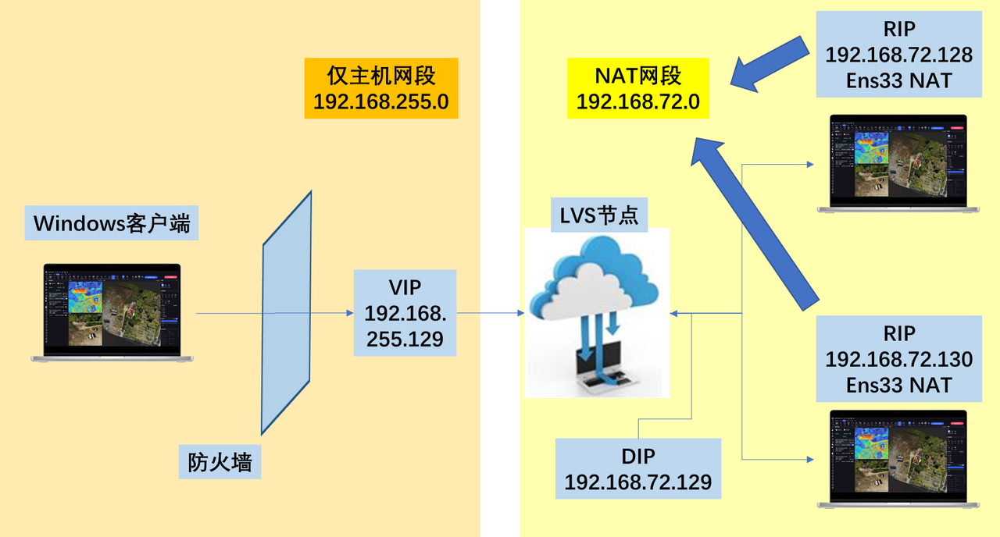
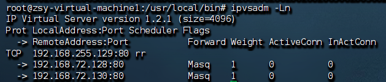
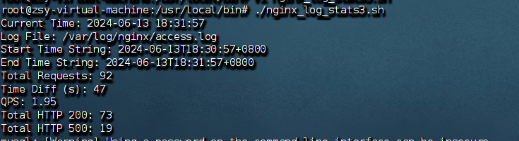

# 2024_training
日常学习及作业相关代码

# 一、项目描述
运维前置学习作业，利用lvs框架搭建后台虚拟机nginx提供html的服务集群，能够实现负载均衡。另一方面，使用shell脚本分析后台服务器nginx日志文本,并进行crontab定时执行的系统配置，统计包括QPS（每秒请求数），http200与http500的请求个数，并将结果数据，统计部署好后的mysql数据库中。

# 二、集群结构示意：
搭建的nginx服务器集群如下所示，设置有VIP对外地址，以及DIP地址，以及后端服务器RIP地址。利用lvs实现负载均衡：

相比基础作业要求，该配置优势在于：
- 后端服务器，设置网关gateway，使其不能通过直接访问ip地址，外面只能通过访问VIP，由lvs调度，确保了安全性
- 客户端与VIP之间加装防火墙设计，防止恶意攻击，更加安全
- 网段规划更合理，服务器集群在一个NAT网段内，模拟客户端以及VIP在另一个网段内，从而让我做实验更方便。（比如，如果都在一个网段，又不加其他设置，就算能ping通，也不能证明是lvs的功劳等）

# 三、集群配置简要说明：
- 后端服务器需要配置好nginx配置文件（sites-available下的default，设置对应html的反向代理。以及确保nginx正常运行）。
- 按照“二”中绘制的结构，配置虚拟机的网络，设置网关防火墙等。其中后端服务器要设置网关指向DIP网段，不要对外开放。
- 通过类似下面的命令，设置lvs集群：
ipvsadm -A -t 192.168.255.129:80 -s rr
简要参数说明：-A：对集群操作。-t：采用TCP协议 -s：负载均衡使用什么调度算法，如rr轮询调度。

- 通过：ipvsadm -a -t  192.168.255.129:80 -r 192.168.72.128:80 -m 添加后端节点。
说明：-r后接后端节点，-m是他们的通信采用NAT模式，后端集群要在一个NAT网段。
最后经过操作，可以使用ipvsadm -Ln显示已有集群信息，包括节点以及后端服务器。

# 四、脚本使用说明：
- nginx_log_stats3.sh，可用过bash运行脚本，统计最近一分钟内的包括QPS（每秒请求数），http200与http500的请求个数，并将结果数据，统计部署好后的mysql数据库中。同时可以打印出执行信息：

- requests.sh，用于在另一台机器上发送curl请求模拟，会在一分钟内随机间隔时间发送 HTTP 请求，有时一秒多次，有时一秒少一次，并且细化为20% 的概率发送触发服务器错误的请求（假设 /error 路径会导致服务器返回 500 错误）,80%概率发送正确请求。
- 脚本要赋予可执行权限。

# 四、前置学习仓库内容说明：
- Coding_Standards是代码规范的一次练习作业。
- html 存放了实验中使用的网页文件。
- ShellScripts 存放了实验中使用的脚本文件。