# 运维：nginx负载均衡搭建，QPS和http code统计分析

## 1  简介

  用户通过www.example.com的方式访问lvs服务，lvs将请求均衡转发到nginx服务，然后根据不同请求路径/静态文件，nginx返回不同html文件内容。

例如：

 www.example.com/hello.html  返回html内容hello world

 www.example.com/mi.html      返回html内容i love xiaomi

  通过shell脚本分析2台nginx机器上的access 日志，把最近一分钟的qps（每秒的请求数）和http code为200 和500+的数量统计出来保存到mysql数据库中。

## 2  功能介绍

流程图：

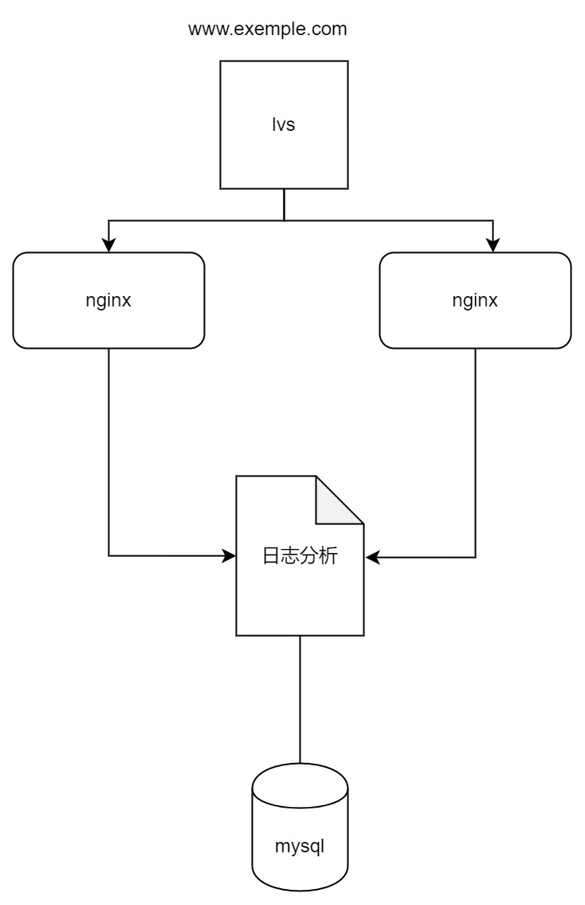

组件说明：

| 组件     | 描述                                                         | 部署方式           | 语言  |
| :------- | ------------------------------------------------------------ | ------------------ | ----- |
| lvs      | 作为整体服务流量入口，能够将请求转发给后端nginx，且能实现流量负载均衡 | lvs NAT模式        |       |
| nginx    | 作为web中间件，接受来自lvs的流量，将nginx服务上的静态html文件返回给用户 | nginx 虚拟主机模式 |       |
| 日志分析 | 通过读取nginx上的access 日志，来分析QPS，统计请求的http code 为200 和5xx的数量 | crontab执行脚本    | shell |
| mysql    | 用来存放分析日志的结果                                       |                    |       |

## 3  实现原理

### 3.1  Linux

  Linux是一款开源、高效、稳定、安全漏洞少的操作系统，其主要应用领域为服务端。本次作业使用的Linux版本为CentOS7。

### 3.2  LVS NAT模式

  LVS的NAT模式是一种负载均衡技术，其中LVS（Linux Virtual Server）作为前端调度器，通过修改数据包的目标地址和源地址来实现请求的分发和响应的返回。在这种模式下，客户端的请求首先发送到LVS的VIP（虚拟IP）上，LVS根据预设的调度算法(本次作业选择RR轮询算法)选择一个Real Server（后端真实服务器）并将请求发送到该服务器。Real Server处理请求后，将响应发送回LVS，LVS再将响应的源地址修改为自己的VIP，然后返回给客户端。整个过程中，数据包的目标地址和源地址都会发生变化，从而实现负载均衡和地址转换。

NAT模式的工作原理可以概括为以下几个步骤：

1. 客户端发送请求到LVS的VIP上。
2. LVS选择一个Real Server，并修改请求的目标地址为Real Server的地址，然后将请求发送给Real Server。
3. Real Server收到请求后，处理请求并发送响应给LVS。
4. LVS收到响应后，修改响应的源地址为自己的VIP，然后将响应发送给客户端。

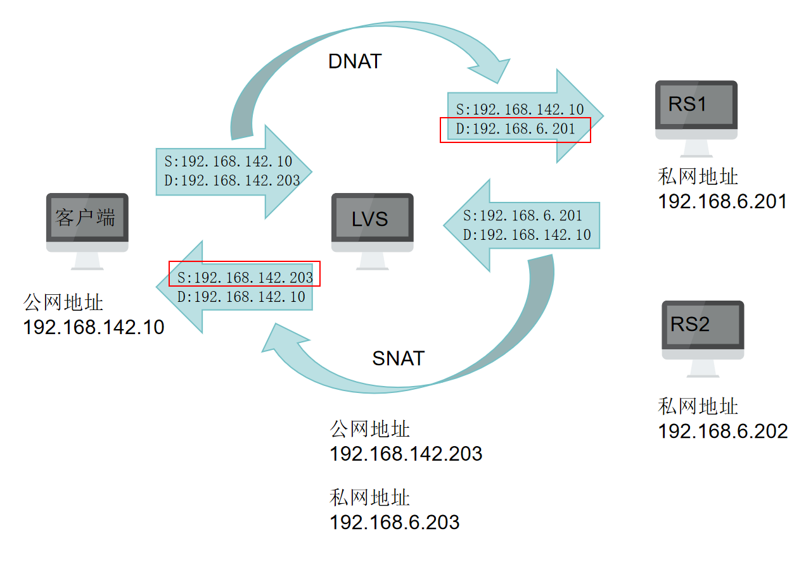

  模式特点：真实服务器必须将网关指向负载调度器；RIP 通常都是私有 IP，仅用于各个集群节点通信；负载调度器必须位于客户端和真实服务器之间，充当网关；负载调度器操作系统必须是 Linux ，真实服务器可以使用任意系统，此次作业使用的真实服务器是Linux系统。

### 3.3  Nginx 虚拟主机模式

  Nginx (engine x) 是一个高性能的 HTTP 和反向代理 web 服务器，同时也提供了 IMAP/POP3/SMTP服务，其特点是占有内存少，并发能力强。虚拟主机是一种特殊的互联网服务，通过虚拟主机，多个网站可以共享一个物理服务器的资源，包括  CPU、内存、硬盘存储和网络带宽。每个网站在虚拟主机上运行，就如同它们各自有一台独立的服务器一样。虚拟主机提供了一种进行网站托管的节约成本的方式，适合于小型和中型网站。Nginx的虚拟主机模式使得访问一个ip下的不同域名可以返回不同目录静态文件。Nginx 的虚拟主机是通过配置文件中的server块来实现的，每个server块可以定义一个虚拟主机，通过不同的server_name指令来区分不同的域名。

Nginx 虚拟主机的工作原理：

1. 客户端发起 HTTP 请求，指定要访问的域名。
2. Nginx 接收到请求后，检查配置文件中的所有 server 块。
3. Nginx 根据请求的域名与 server_name 指令匹配，以此确定哪个虚拟主机块会处理该请求。
4. 一旦匹配成功，Nginx 将使用该 server 块中定义的配置来处理请求，例如定向到特定的网站目录或代理请求等。

以下是一个基于域名的虚拟主机配置示例：

```Nginx
server {
    listen       80;                  # 监听的端口
    server_name  www.example.com;     # 域名
    index  index.html mi.html;   # 默认文件
    root   html/example;  # 网站相对路径
     
    # 其他配置...

}
```

  在这个配置中，当用户访问 `www.example.com` 时，Nginx 会将请求定向到 html/example 目录下，并尝试提供默认的 index.html 或 mi.html 文件。

## 4  部署方式

### 4.1  环境准备

#### 4.1.1  机器规划

| 角色         | 外网IP（网卡2 仅主机模式） | 内网IP（网卡1 NAT模式） |
| ------------ | -------------------------- | ----------------------- |
| LVS          | 192.168.142.203            | 192.168.6.203           |
| Nginx（RS1） |                            | 192.169.6.201           |
| Nginx（RS2） |                            | 192.168.6.202           |

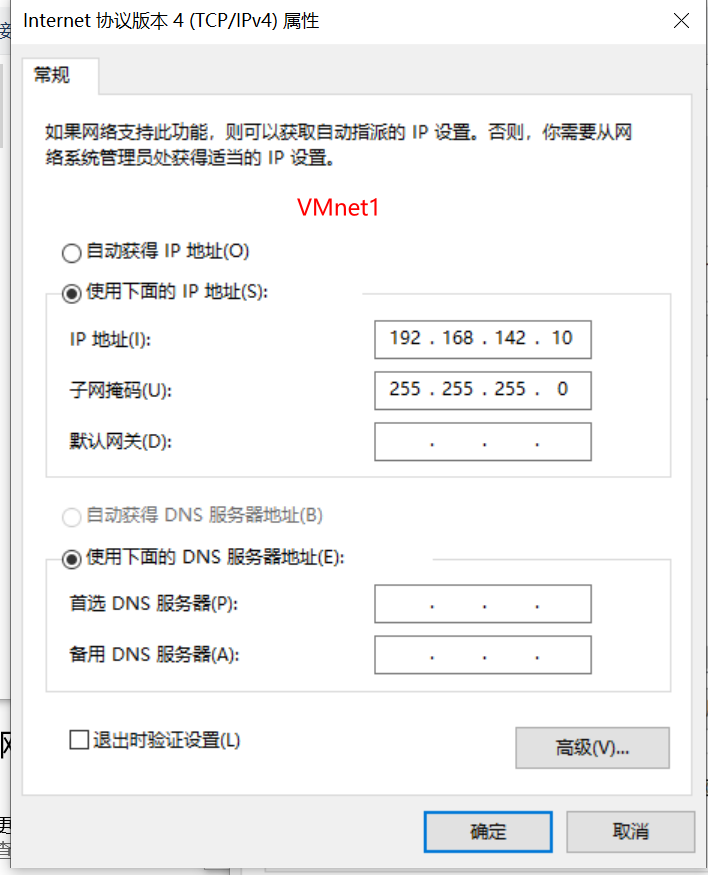

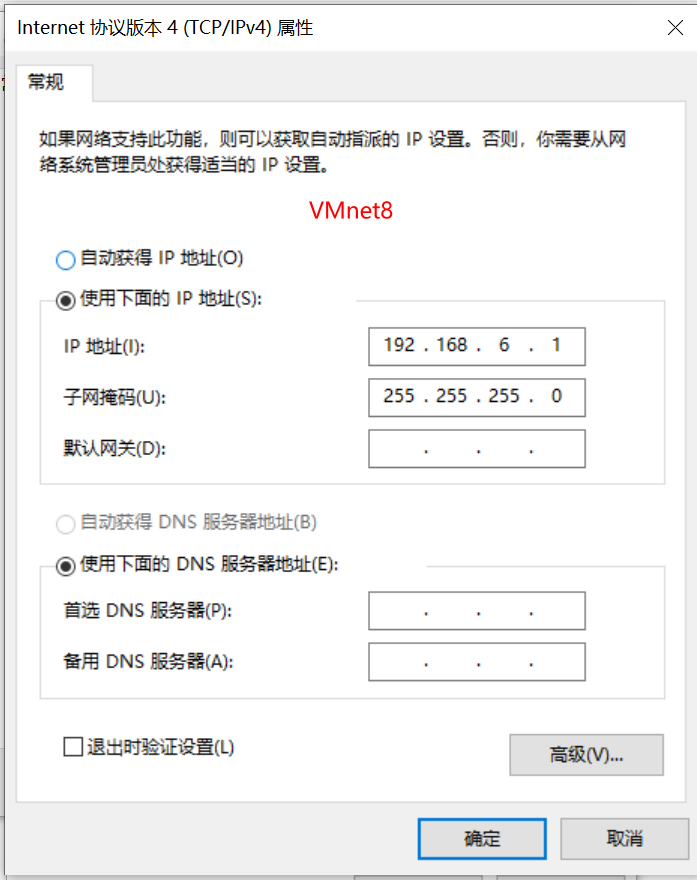

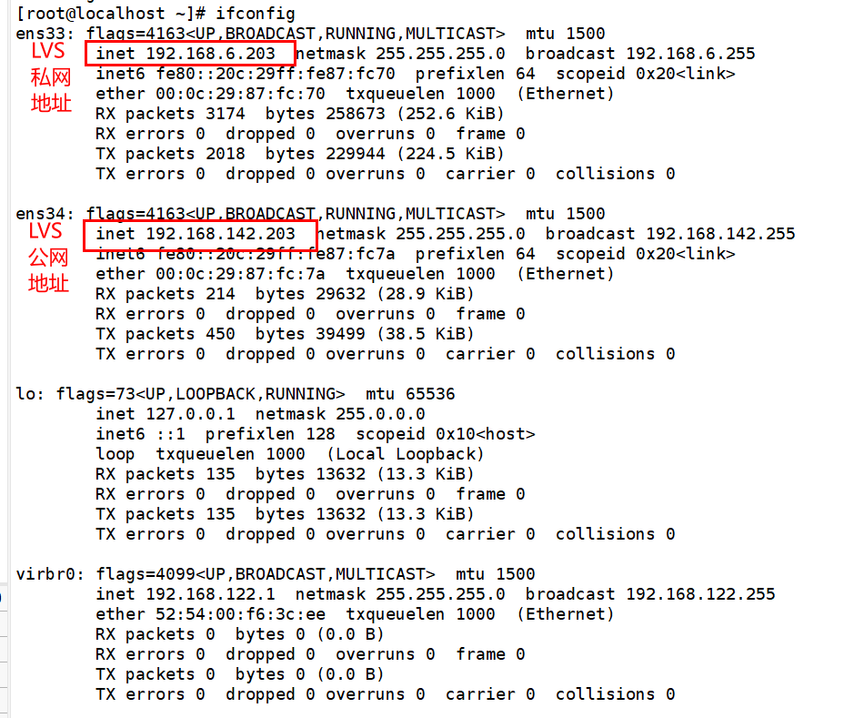

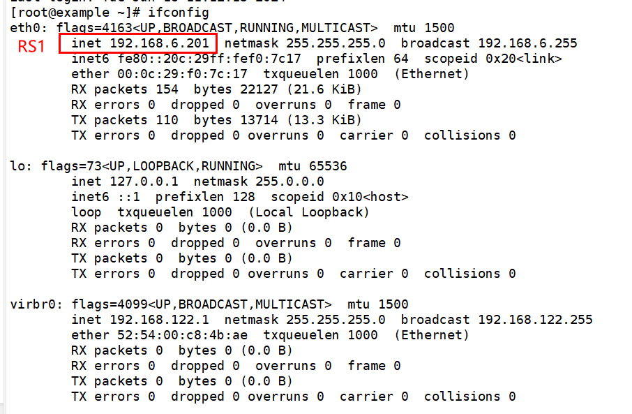

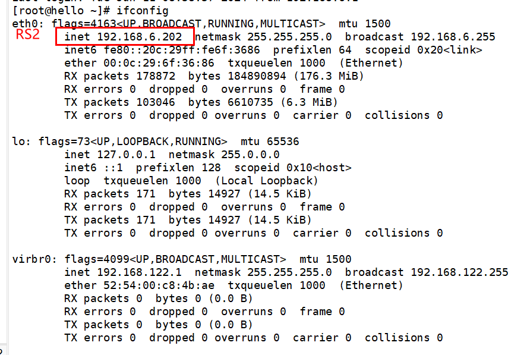

#### 4.1.2  关闭防火墙和selinux（所有服务器）

[root@localhost ~]# systemctl stop firewalld

[root@localhost ~]# systemctl disable firewalld

[root@localhost ~]# setenforce 0

[root@localhost ~]# sed -i ‘7s/enforcing/disabled/’ /etc/selinux/config （重启后生效）

### 4.2  配置真实服务器(RS1和RS2)

#### 4.2.1  搭建LNMP平台

4.2.1.1  配置网络yum源

[root@localhost ~]# cd /etc/yum.repos.d/

[root@localhost yum.repos.d]# rm -rf *

[root@localhost yum.repos.d]# wget http://mirrors.aliyun.com/repo/Centos-7.repo 

[root@localhost yum.repos.d]# wget http://mirrors.aliyun.com/repo/epel-7.repo

[root@localhost yum.repos.d]# yum clean all

[root@localhost yum.repos.d]# yum -y install gcc gcc-c++ pcre-devel openssl openssl-devel zlib-devel ncurses-devel cmake bison libxml2-devel libpng-devel

 4.2.1.2  源码软件包安装

①Nginx

[root@localhost ~]# mkdir /lnmp

[root@localhost ~]# cd /lnmp

- 下载 nginx、mysql、php 源码包

[root@localhost lnmp]# wget http://nginx.org/download/nginx-1.12.2.tar.gz

[root@localhost lnmp]# wget https://cdn.mysql.com//Downloads/MySQL-5.5/mysql-5.5.62.tar.gz

[root@localhost lnmp]# wget https://www.php.net/distributions/php-7.1.29.tar.gz

- 编写nginx 启动管理脚本

[root@localhost lnmp]# vim /etc/init.d/nginx

```bash
#!/bin/bash 
#Author：liu 
#chkconfig: 2345 99 33 
#description: nginx server control tools  
ngxc="/usr/local/nginx/sbin/nginx" 
pidf="usr/local/nginx/logs/nginx.pid" 
ngxc_fpm="/usr/local/php/sbin/php-fpm" 
pidf_fpm="/usr/local/php/var/run/php-fpm.pid" 
case "$1" in 
    start) 
        $ngxc -t &> /dev/null 
        if [ $? -eq 0 ];then 
                $ngxc 
                $ngxc_fpm 
                echo "nginx service start success!" 
        else 
                $ngxc -t 
        fi 
        ;; 
    stop) 
        kill -s QUIT $(cat $pidf) 
        kill -s QUIT $(cat $pidf_fpm) 
                echo "nginx service stop success!" 
        ;; 
    restart) 
        $0 stop 
        $0 start 
        ;; 
    reload) 
        $ngxc -t &> /dev/null 
        if [ $? -eq 0 ];then 
                kill -s HUP $(cat $pidf) 
                kill -s HUP $(cat $pidf_fpm) 
                echo "reload nginx config success!" 
        else 
                $ngxc -t 
        fi 
        ;; 
    *) 
        echo "please input stop|start|restart|reload." 
        exit 1 
esac
```

[root@localhost ~]# chmod +x /etc/init.d/nginx

[root@localhost ~]# chkconfig --add nginx

- 创建用于运行 Nginx 的用户

[root@localhost lnmp]# useradd -r -s /sbin/nologin nginx

- 解压缩 Nginx 并安装

[root@localhost lnmp]# tar -xf nginx-1.12.2.tar.gz 

[root@localhost lnmp]# cd nginx-1.12.2/

[root@localhost nginx-1.12.2]# ./configure --prefix=/usr/local/nginx --user=nginx --group=nginx --with-http_stub_status_module --with-http_ssl_module && make && make install

②MySQL

[root@localhost lnmp]# tar -xf mysql-5.5.62.tar.gz 

[root@localhost lnmp]# cd mysql-5.5.62/

-  创建用于运行 Mysql 的用户

[root@localhost mysql-5.5.62]# useradd -r -s /sbin/nologin mysql

- 解压缩 Mysql 并安装

[root@localhost mysql-5.5.62]# cmake -DCMAKE_INSTALL_PREFIX=/usr/local/mysql -DMYSQL_UNIX_ADDR=/tmp/mysql.sock -DEXTRA_CHARSETS=all -DDEFAULT_CHARSET=utf8 -DDEFAULT_COLLATION=utf8_general_ci -DWITH_MYISAM_STORAGE_ENGINE=1 -DWITH_INNOBASE_STORAGE_ENGINE=1 -DWITH_MEMORY_STORAGE_ENGINE=1 -DWITH_READLINE=1 -DENABLED_LOCAL_INFILE=1 -DMYSQL_USER=mysql -DMYSQL_TCP_PORT=3306 && make && make install

[root@localhost ~]# ln -s /usr/local/mysql/bin/*  /usr/local/bin

-  修改安装后的目录权限

[root@localhost ~]# cd /usr/local/mysql

[root@localhost mysql]# chown -R root .

[root@localhost mysql]# chown -R mysql data

- 生成 Mysql 配置文件

[root@localhost mysql]# cp -a /lnmp/mysql-5.5.62/support-files/my-medium.cnf /etc/my.cnf
cp：是否覆盖"/etc/my.cnf"？ y

- 初始化，生成授权表

[root@localhost mysql]# ./scripts/mysql_install_db --user=mysql

- 生成 Mysql 的启动和自启动管理脚本

[root@localhost mysql]# cd /lnmp/mysql-5.5.62/support-files

[root@localhost support-files]# cp -a mysql.server /etc/init.d/mysqld

[root@localhost support-files]# chmod +x /etc/init.d/mysqld

[root@localhost support-files]# chkconfig --add mysqld

[root@localhost support-files]# systemctl start mysqld

- 给 mysql 的 root 用户设置密码

[root@localhost support-files]# mysqladmin -uroot password 123456

③PHP

- 解压缩 PHP 并安装

[root@localhost lnmp]# tar -xf php-7.1.29.tar.gz 

[root@localhost lnmp]# cd php-7.1.29/

[root@localhost php-7.1.29]# ./configure --prefix=/usr/local/php/ --with-config-file-path=/usr/local/php/etc/ --with-mysqli=/usr/local/mysql/bin/mysql_config --enable-soap --enable-mbstring=all --enable-sockets --with-pdo-mysql=/usr/local/mysql --with-gd --without-pear --enable-fpm && make && make install

- 生成 php 配置文件

[root@localhost php-7.1.29]# cp -a /lnmp/php-7.1.29/php.ini-production /usr/local/php/etc/php.ini

- 创建软连接，方便使用 php 相关命令

[root@localhost php-7.1.29]# ln -s /usr/local/php/bin/* /usr/local/bin/

[root@localhost php-7.1.29]# ln -s /usr/local/php/sbin/* /usr/local/sbin/

- 配置 Nginx 连接 PHP

[root@localhost php-7.1.29]# cd /usr/local/php/etc/

- 启动 php-fpm 服务

[root@localhost etc]# cp -a php-fpm.conf.default php-fpm.conf

[root@localhost etc]# vim php-fpm.conf

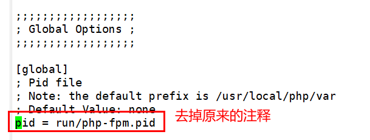

[root@localhost etc]# cd php-fpm.d/

[root@localhost php-fpm.d]# cp -a www.conf.default www.conf

[root@localhost php-fpm.d]# vim www.conf

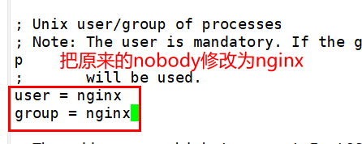

- 修改 Nginx 的配置文件，使其识别.php 后缀的文件

[root@localhost php-fpm.d]# cd /usr/local/nginx/conf/

[root@localhost conf]# vim nginx.conf


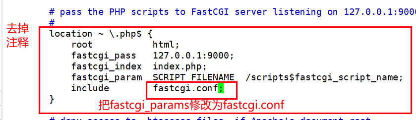

- 重启 Nginx 服务

[root@localhost conf]# systemctl restart nginx


#### 4.2.2  Nginx 虚拟主机

[root@localhost ~]# cd /usr/local/nginx/html

[root@localhost html]# mkdir example

[root@localhost html]# vim example/hello.html

写入：hello world!

[root@localhost html]# vim example/mi.html

写入：i love xiaomi.

[root@localhost html]# vim /etc/hosts

新增：192.168.6.201 www.example.com

[root@localhost ~]# vim /usr/local/nginx/conf/nginx.conf

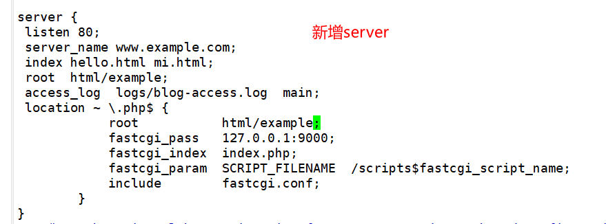

测试网页

[root@localhost ~]# curl www.example.com/mi.html

i love xiaomi.

#### 4.2.3  修改网关地址

\[root@localhost ~]# vim /etc/sysconfig/network-scripts/ifcfg-eth0

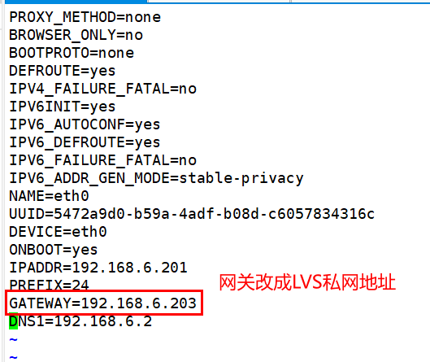

### 4.3  配置负载均衡器（LVS）

- 配置yum源

\[root@localhost ~]# mkdir /mnt/cdrom

\[root@localhost ~]# mount -t iso9660 /dev/cdrom /mnt/cdrom/

\[root@localhost ~]# cd /etc/yum.repos.d/

[root@localhost yum.repos.d]# mkdir back

[root@localhost yum.repos.d]# mv * back/

[root@localhost yum.repos.d]# cp -a back/CentOS-Media.repo .

[root@localhost yum.repos.d]# vim CentOS-Media.repo


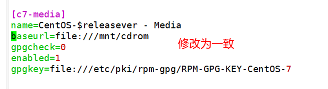


[root@localhost yum.repos.d]# yum clean all

[root@localhost yum.repos.d]# yum -y install gcc gcc-c++ lrzsz

- 打开路由转发功能


[root@localhost ~]# echo "net.ipv4.ip_forward = 1" >> /etc/sysctl.conf

- 加载LVS内核模块


\[root@localhost ~]# modprobe ip_vs

- 安装LVS管理工具：ipvsadm


\[root@localhost ~]# yum -y install ipvsadm

[root@localhost ~]# systemctl enable ipvsadm

- 添加防火墙记录,当源地址是内网网段并且出口网卡为 ens34 的时候进行 SNAT 转换，转换源地址为外网卡地址

[root@localhost ~]# iptables -t nat -A POSTROUTING -s 192.168.6.203/24 -o ens34-j SNAT --to-source 192.168.142.203

[root@localhost ~]# iptables -t nat -L

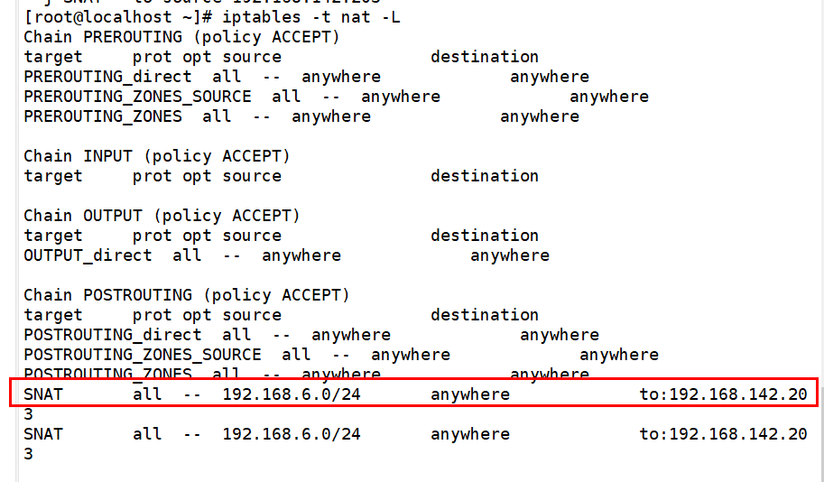


- 使用ipvsadm命令设置规则

- 添加 ipvsadm TCP 集群

[root@localhost ~]# ipvsadm -A -t 192.168.142.203:80 -s rr

- 添加 ipvsadm 节点

[root@localhost ~]# ipvsadm -a -t 192.168.142.203:80 -r 192.168.6.201:80 -m

[root@localhost ~]# ipvsadm -a -t 192.168.142.203:80 -r 192.168.6.202:80 -m

- 保存 ipvs 集群设置到文件进行持久化

[root@localhost ~]# ipvsadm --save -n >/etc/sysconfig/ipvsadm

[root@localhost ~]# ipvsadm -Ln

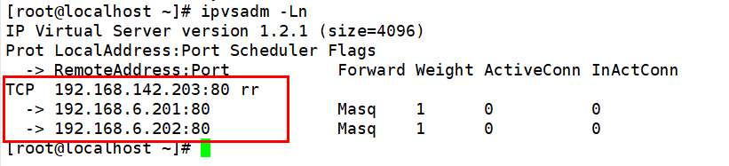

- 修改客户端的hosts文件


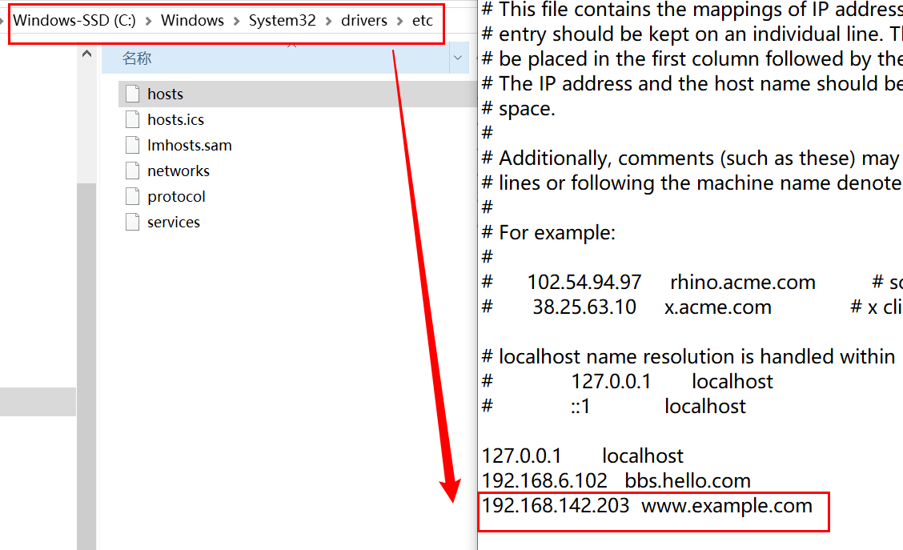

- 测试集群


### 4.4  crontab执行脚本（RS1和RS2）

4.4.1  创建数据库和表

[root@example ~]# mysql -u root -p

mysql> CREATE DATABASE mydatabase;

mysql> USE mydatabase;

mysql> CREATE TABLE nginx_stats (  
    ->     id INT AUTO_INCREMENT PRIMARY KEY,  
    ->     timestamp DATETIME NOT NULL,  
    ->     qps FLOAT NOT NULL,  
    ->     status_200 INT NOT NULL,  
    ->     status_500_plus INT NOT NULL  
    -> );

4.4.2  编辑脚本

[root@example ~]# vim /usr/local/nginx/logs/access_log.sh

```bash
#!/bin/bash

# Nginx access log file path
LOG_FILE="/usr/local/nginx/logs/access.log"

# MySQL database connection settings
DB_HOST="localhost"
DB_USER="root"
DB_PASS="123456"
DB_NAME="mydatabase"
DB_TABLE="nginx_stats"

# Function to count qps and status codes for a given time range
count_qps_status_codes() {
    local start_time=$1
    local end_time=$2 

    local qps=0
    local count_200=0
    local count_500_plus=0

    local lines=$(cat "$LOG_FILE" | wc -l)
    for (( i=1; i<=$lines; i++)); do
    	log=$(sed -n "$i"p "$LOG_FILE")
    	logtime=$(echo "$log" | awk '{print $4}' | sed "s/\[//g" | sed "s/\// /g" | awk -F ":" '{print $1" "$2":"$3":"$4}')
    	logtime=$(date -d "$logtime" +%s)
    	if [ $logtime -ge $start_time -a $logtime -le $end_time ] 
    	then
    		qps=$((qps + 1))
    		http_code=$(echo "$log" | awk '{print $9}')
            if [ $http_code -eq 200 ] 
            then 
                count_200=$((count_200 + 1))
            elif [ $http_code -ge 500 -a $http_code -lt 600 ] 
            then 
                count_500_plus=$((count_500_plus + 1))
            fi
        fi
    done

	passtime=60
	qps=$(echo "scale=4; $qps / $passtime" | bc)
    echo $qps" "$count_200" "$count_500_plus
        

}


current_timestamp=$(date +%s) 
start_time=$((current_timestamp - 60))
end_time=$current_timestamp


qps_status_codes=$(count_qps_status_codes "$start_time" "$end_time")
qps=$(echo "$qps_status_codes" | awk '{print $1}')
status_200=$(echo "$qps_status_codes" | awk '{print $2}')
status_500_plus=$(echo "$qps_status_codes" | awk '{print $3}')

mysql_command="INSERT INTO $DB_TABLE (timestamp, qps, status_200, status_500_plus) VALUES (NOW(), '${qps}', '${status_200}', '${status_500_plus}');"

LAST_ID=$(mysql -h "$DB_HOST" -u "$DB_USER" -p"$DB_PASS" "$DB_NAME" -e "$mysql_command" -Bse "SELECT LAST_INSERT_ID();")
if [ $? -ne 0 ]; then
    echo "MySQL command failed!"  
    exit 1
fi
if [ -z "$LAST_ID" ]; then
    echo "Failed to get LAST_INSERT_ID" 
else
    echo "Data inserted successfully! New ID: $LAST_ID"  
fi


```

[root@example ~]# chmod +x /usr/local/nginx/logs/access_log.sh

4.4.3  设置每分钟执行一次脚本

[root@example ~]# crontab -e

写入：* * * * *  /usr/local/nginx/logs/access_log.sh

